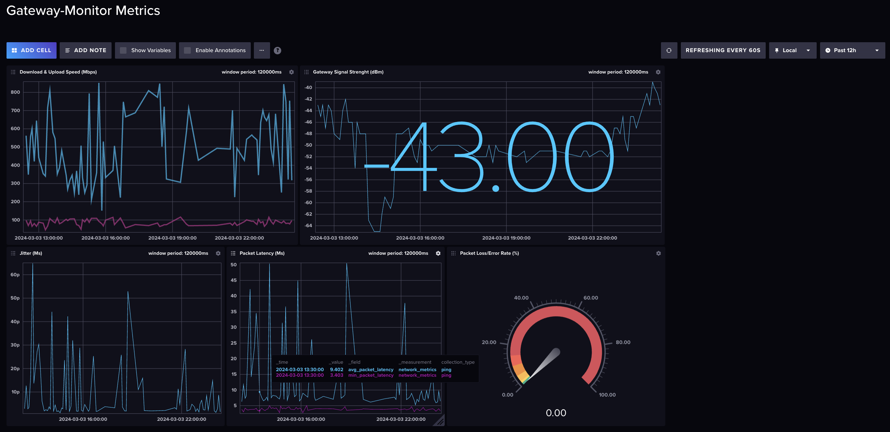

# gateway-monitor
A diagnostic monitoring tool that collects metrics about a home internet gateway's performance. Useful for measuring internet speed over time, detecting performance degradation, being notified of early signs of service outages, etc.

## Statistics Reported
- Gateway Signal Strenth (dBm - decibels relative to a milliwatt)
- Download Speed (Mbps)
- Upload Speed (Mbps)
- Packet Loss/Error Rate (% of packets transmitted & received)
- Round-trip packet traversal time (ms) min/avg/max/stddev
- Jitter (average ms) - the variability in the latency of packets over a gateway network

## Supported Operating Systems
macOS, Linux

## Output
```
Gateway IP: 10.0.0.1
Measurements are classified into groups: Excellent, Good, Fair, Poor/Weak
Gateway Signal Strength: -55 (Good)
Download Speed: 759.32
Upload Speed: 91.63
Packet Loss percentage: 0
Round-trip min/avg/max/stddev = 4.2/7.58896/21.108/3.337278
```

## Dashboard of Metrics Streamed to the InfluxDB
